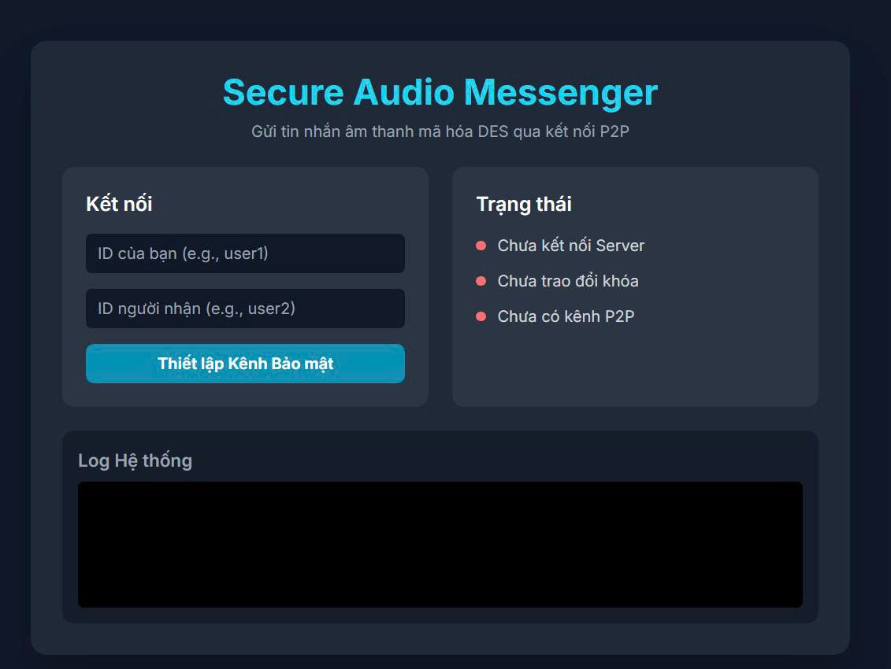
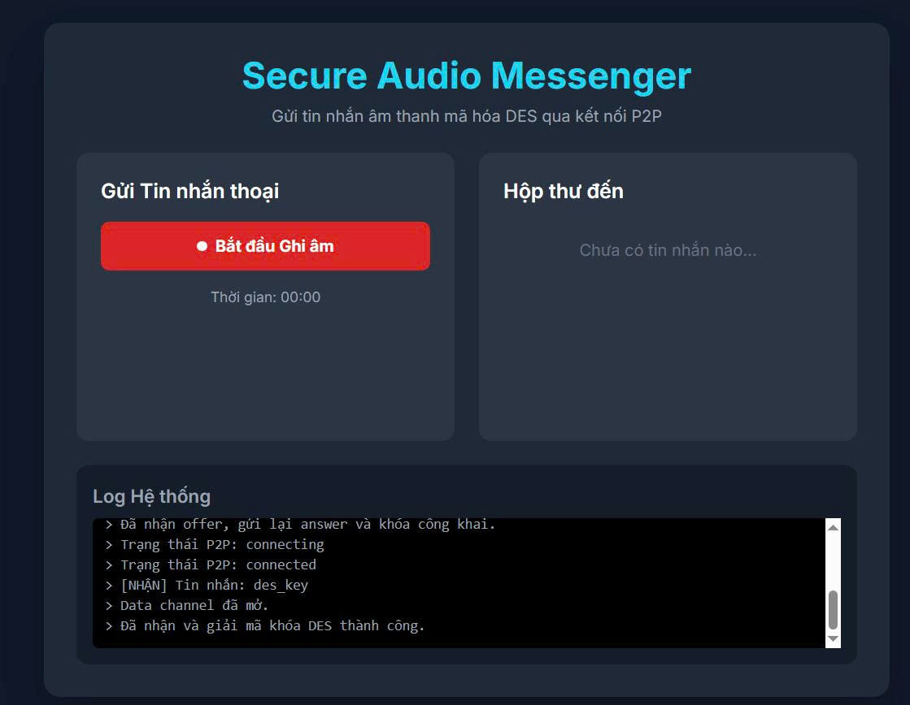
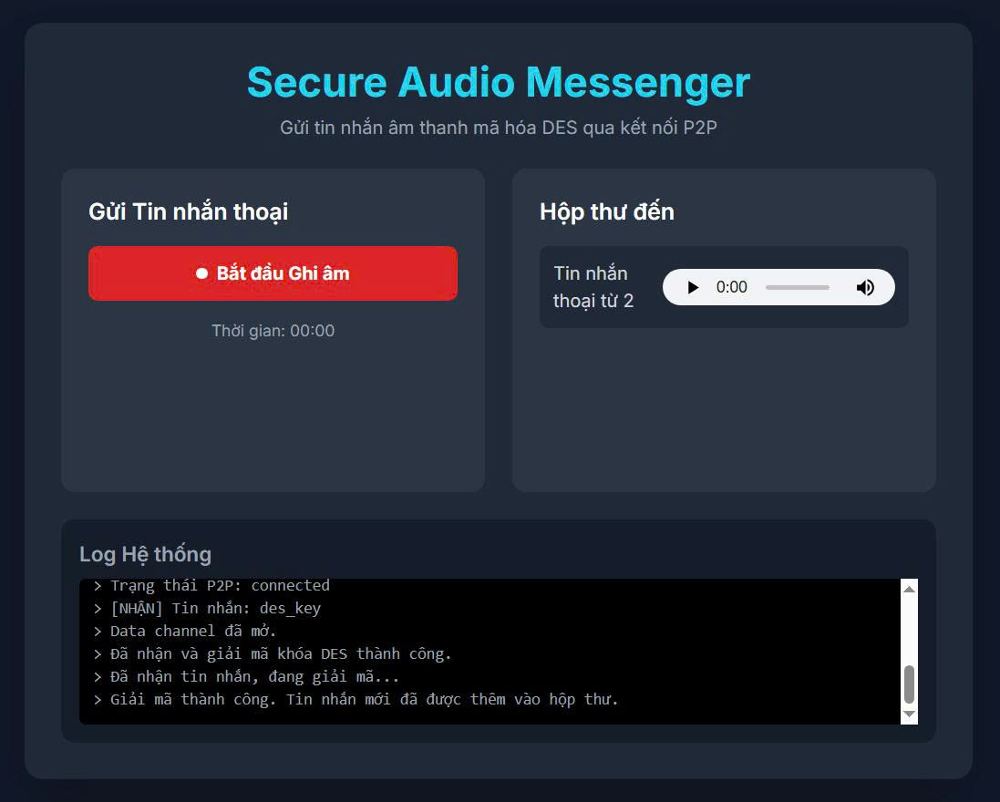

<h1 align="center">🔐 Ứng dụng Bảo mật Tin nhắn Âm thanh</h1>
<p align="center">An toàn - Xác thực - Toàn vẹn qua DES & RSA</p>

---

## 📌 Giới thiệu

Ứng dụng được phát triển trong học phần **Nhập môn An toàn, Bảo mật Thông tin**, với mục tiêu xây dựng hệ thống **gửi nhận tin nhắn âm thanh an toàn sử dụng WebRTC (P2P)**.

<p align="center">
  
  
  
</p>

---

## 🔐 Tính năng Bảo mật

| Thành phần           | Phương pháp sử dụng                                          |
|---------------------|---------------------------------------------------------------|
| 🔒 Mã hóa dữ liệu     | DES (Chế độ CBC)                                            |
| 🔏 Xác thực          | RSA 2048-bit (OAEP + SHA-256)                                |
| 🛡️ Kiểm tra toàn vẹn | SHA-256 để tạo và kiểm tra giá trị băm dữ liệu               |

---

## 🧩 Thành phần Hệ thống

- **Frontend**: `index.html`, JavaScript (Web Audio API, Web Crypto API)
- **Backend**: `signaling_server.py` sử dụng `websockets`, `asyncio`
- **Kênh truyền âm thanh**: WebRTC (kết nối P2P)
- **Giao tiếp tín hiệu**: WebSocket qua localhost

---

## 🚀 Cách Cài Đặt & Chạy

### 1. Yêu cầu

- **Python** >= 3.8
- **Trình duyệt**: Chrome / Firefox (hỗ trợ WebRTC & Web Audio API)
- **Thư viện**:
  ```bash
  pip install websockets
  ```

### 2. Chạy máy chủ tín hiệu

```bash
python signaling_server.py
```

> Server chạy tại `ws://localhost:8765`

### 3. Chạy giao diện người dùng

```bash
python -m http.server 8000
```

> Truy cập `http://localhost:8000` → Mở `index.html`

---

## 🎙️ Chức năng chính

- 🎤 Ghi âm, mã hóa và gửi tin nhắn âm thanh qua P2P
- ✅ Hiển thị trạng thái kết nối, log hệ thống
- 📥 Hộp thư đến: hiển thị danh sách tin nhắn nhận
- 🔐 Bảo mật dữ liệu với DES + RSA + SHA-256

---

## 🔄 Quy trình Bảo mật

1. 🤝 **Bắt tay**: Client A gửi "Hello!", Client B phản hồi "Ready!"
2. 🔑 **Trao đổi khóa RSA**
3. 🧾 **Ký số metadata + mã hóa khóa DES**
4. 🎧 **Gửi file âm thanh mã hóa DES**
5. ✅ **Kiểm tra chữ ký + hash để đảm bảo toàn vẹn**

---

## ⚠️ Hạn chế

- DES có độ bảo mật thấp (chỉ 56-bit)
- Giao diện HTML chưa tích hợp đầy đủ JavaScript xử lý WebRTC & Crypto
- Chưa có xác thực client từ server tín hiệu

---

## 📊 Kết quả thử nghiệm (giả định)

| Dung lượng | Mã hóa | Truyền | Giải mã |
|------------|--------|--------|---------|
| 1 MB       | ~0.5s  | ~1.0s  | ~0.4s   |
| 10 MB      | ~4.0s  | ~8.0s  | ~3.5s   |

---

> 📁 **Repo này phù hợp mục đích học tập và thử nghiệm bảo mật P2P đơn giản.**

---

🎓 *Được thực hiện bởi sinh viên học phần ATBMTT - 2025*
